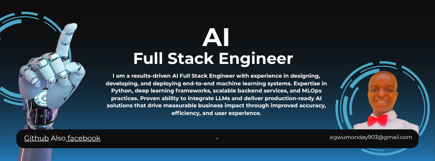

<!-- HERO SECTION -->

<picture>
<source media="(prefers-color-scheme: dark)" srcset="./assets/banner-dark.png">
<source media="(prefers-color-scheme: light)" srcset="./assets/banner-light.png">

</picture>

# Hi, I'm Egwu Monday 👋 — An AI Full Stack Engineer | Building Intelligent Systems and Implementing Agentic Workflows with RAG System

### 🔗 Connect with me

<a href="https://linkedin.com/in/https://www.linkedin.com/in/monday-egwu-274756326">
  

### 🛠️ Core Technologies

 

<!--  TABLE OF CONTENTS  -->

## 📑 Table of Contents

- [🎯 Current Focus](#-current-focus)
- [💥 Impact & Highlights](#-impact--highlights)
- [🧰 Tech Stack](#-tech-stack)
- [📊 GitHub Stats](#-github-stats)
- [🎬 Project Showcase](#-project-showcase)
- [📫 Get in Touch](#-get-in-touch)

---

<!--CURRENT FOCUS -->

## 🎯 Current Focus

- 🔭 Currently working on **[AI-powered personal expense and investment tracker]** — I am tired of having cash lickage, so i am currently working on this project so that while i am busy working with the team, my expenses would be tracked by the project
- 🌱 Currently learning **BACKEND, RAG, HALLUCINATION_FREE_IMPLEMENTATION**
- 🤝 Open to collaborating on **Data modelling, AI projects, tech talks**
- 💬 Ask me about **DATA MODELLING, AI PROJECTS AND ELECTRICAL INSTALLATION**
- ⚡ Fun fact: **I LOVE HAVING CONVERSATION ABOUT THE HARD PROJECT😀**

---

<!-- IMPACT BULLETS -->

## 💥 Impact & Highlights

- 🚀 Built and shipped **HOTEL-INTELLIGENT-AND-REVENUE-PRESERVSTION-SYSTEM**, **GLBot1.0** and some more!
- 👥 Led a team of **12** engineers and succesfully delivered **EDU-TRACKER-PROJECT** ahead of schedule
- 📦 Built more than 5 advanced data modelling and Model pridicting projects. You can check that out in my repo.
- 🏆 Currently leading a team of 12 to launch projects

---

<!--  TECH STACK (ICON-BASED)  -->

## 🧰 Tech Stack

<table>
<tr>
<td valign="top" width="33%">

**Languages**

</td>
<td valign="top" width="33%">

**Frameworks**

</td>
<td valign="top" width="33%">

**Tools & Cloud**

</td>
</tr>
</table>

---

<!--  DYNAMIC STATS  -->

## 📊 GitHub Stats

<!-- Trophy display -->

---

<!--  VISUAL / MEDIA SHOWCASE  -->

## 🎬 Project Showcase

### [PROJECT NAME] — [one-line tagline]

**Static screenshot** (standard Markdown syntax):

**Demo recording** (GIF/MP4 hosted in the local `/assets` folder, referenced via relative path):

---

<!--  CONTACT  -->

## 📫 Get in Touch

**Have a project in mind or just want to connect?**

[LinkedIn](https://linkedin.com/in/https://www.linkedin.com/in/monday-egwu-274756326) · [Twitter](https://twitter.com/https://x.com/IkwuocheG)

 

⭐️ If any of my projects helped you, consider giving them a star!

